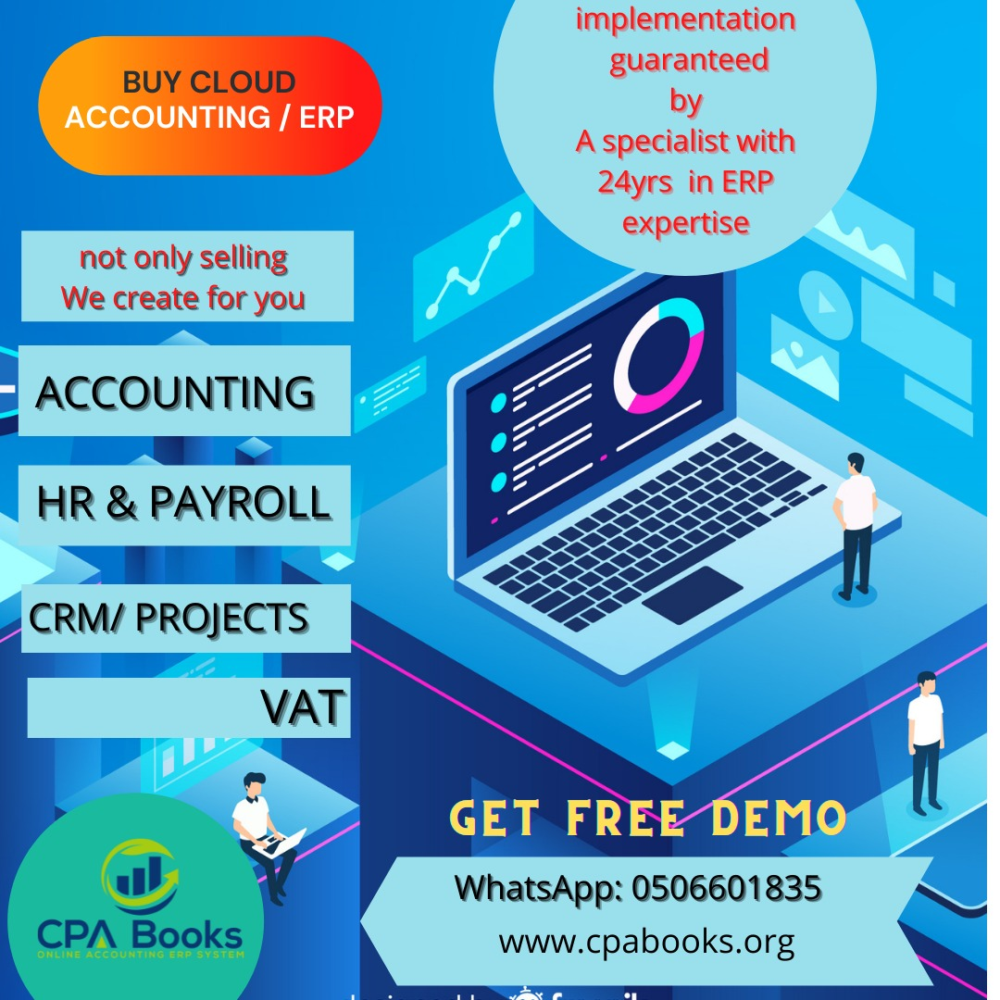

.. _about:

.. meta::
   :description: Title: CPAbooks 14 Best Practices, Author: CPAbooks, Category: Books, Price: Free
   :keywords: CPAbooks Online Book, CPAbooks Functional Book, CPAbooks CookBook, Implement CPAbooks Version 12.0, Mantavya, Gajjar

.. index::
   single: About Online Book
   single: CPAbooks 14 Best Practices
   single: About Author
   single: About Reviewer

============================
About CPAbooks Best Practices
============================

CPAbooks Best Practices book is dedicated for functional consultants
or entrepreneur who wants to implement or use CPAbooks online Cloud ERP all-in-one business services.

application out-of-the box. This is an online book written based on CPAbooks
**Community** and **Enterprise** Edition.

This book covers best implementation approach for most used applications
such as Sales, Purchase, Inventory, Financial Accounting, Manufacturing, Project Management, Logistic Services, Facilities Management CRM and Payrolls.

Why this CPAbook?
==============

CPAbooks is a fast-growing With itscloud-based
hosting and browser base functionality CPAbooks-ERP
can be accessed from anywhere, any device with any
operating system.With its integrated modular
functionalities covering all business processes made
it the most preferred ERP. It’s a cost effective, simple
and scalable solution efficiently suitable for small to
large business enterprises. It has added security
features like IP address restriction to protect the
data from unauthorized access

Credits
=======

Thanks to all the contributors of CPAbooks Official Documentation project as
many pages/topics of this book was actually taken from
https://www.CPAbooks.org

License
=======

All the pages, images and videos of CPAbooks Books are free to use modify
and reuse on blog, forum, support platform, etc. They are provided under
Creative Commons Attribution-NonCommercial-ShareAlike 4.0 International
License. Please credits to https://CPAbooksbooks.org when using page(s) from
CPAbooks Online Book.

.. |image0| image:: ./images/licenses.png
   :width: 0.91667in
   :height: 0.32292in

Creative Commons License

CPAbooks Book is licensed under a Creative Commons
Attribution-NonCommercial-ShareAlike 4.0 International License.

Updates
=======
You can subscribe to `Youtube <https://www.youtube.com/channel/UCcKKLlJw18jXPKtPMx7HnoA>`_
channel to receive an instance update about the new videos and pages on this book.

You can follow `Twitter <https://twitter.com/CpabooksS>`_ channel
to get the updates about the book.

About the Author
================

Abdus Stm SENIOR FINANCE & BUSINESS PROFESSIONAL Over 24 years’ rich, cross-cultural experience in Global Multi-Million Dollar organizations with impressive success in Business strategic & financial planning, financial control, accounting functions, ERP Development & Implementations. During his professional and business career have had played various roles such as CEO, ERP Developent Project Manager, General Manager, Finance Manager, Senior officer, Chief Accountant, Managing Director Junior Accountant Financial Advisor and all across State of Qatar, Kingdom of Saudi Arabia, Bangladesh & United Arab Emirates (Abu Dhabi & Dubai) He worked with EMCOR UK (Plc) Qatar, EFS Facilities Services Saudi Arabia, Scholastica Group, Bangladesh, EFS Facilities Services Abu Dhabi, EFS Facilities Services Dubai, Al Ishraf Electrical Contracting LLC, Macrobert Associates FZE & CPAbooks IT Middle East.

About the Reviewer
==================

Preface
=======

The CPAbooks online book covers the implementation best practices and
approach to configure the business applications out-of-the-box. With
this approach you can configure your CPAbooks online instance or CPAbooks.sh or
locally installed CPAbooks on your server.

Page structure
==============

Each single page on this book have the real time business case and how
that business can be configure with CPAbooks standard features. The page
divides in the specific sections, each sections give you enough
information to solve the business problem. The major sections as below.

Problem statement
-----------------

The page has a single line problem statement such as “Create my first quotation”,
give you brief information about the business situation, where it uses and which
business requires to deal with such situation. Most of the problem
statement are “how to ..” questions.

Business case
-------------

This section gives you a real-life business case.

Configuration
-------------

this sections give you a step-by-step configuration, that help you to
fit the real-life business problem in CPAbooks using the standard features. Some of
the page give you steps to configure the options.

Video
-----

This section gives you a link on the PDF or embedded videos on the
online book, that shows you the detailed configuration steps and the
steps to execute the business case. You can get access to all the videos
used in this book at `Youtube <https://www.youtube.com/channel/UCcKKLlJw18jXPKtPMx7HnoA
>`_.

See also
--------

This section has the useful links to the related business cases.

Conventions
===========

There are different text styles, that used to differentiate the
informations, like **Bold text** used to name any screen label, menus,
or static information available on the screen while *Italic text* always
represents the value.

Images are used to illustrate the confirmation or result, you can
understand the topics explain about the which business features and
configuration.
