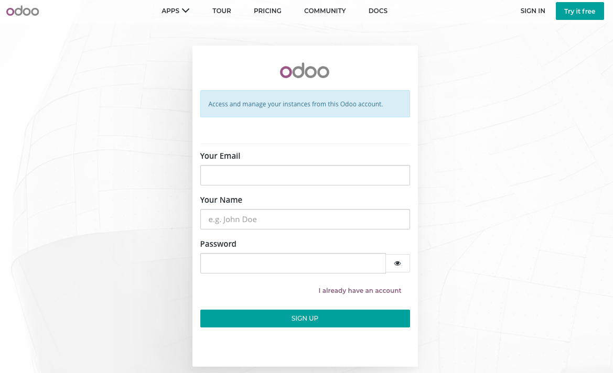
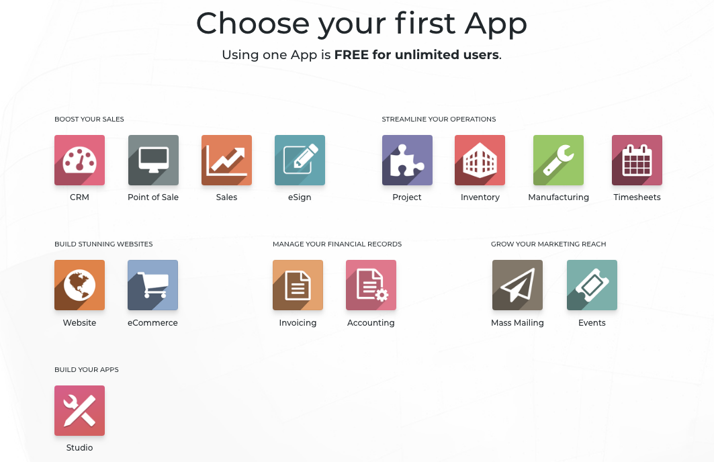
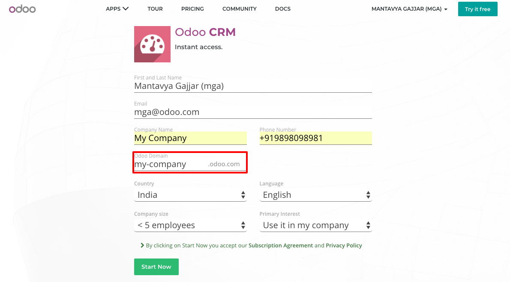
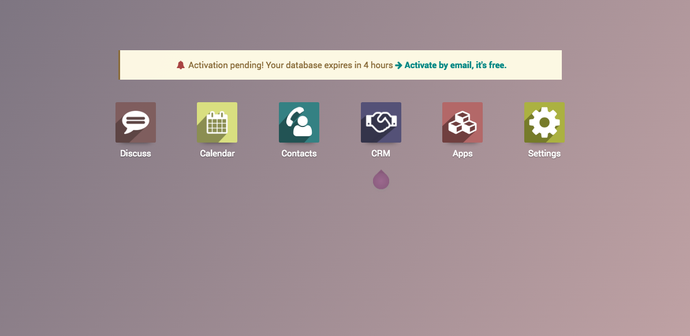

.. _firstinstance:

.. index::
   single: Create Instance
   single: Online Instance
   single: Supported Browser
   single: Activate instance
   single: Free trial

==========================
Create first CPAbooks instance
==========================

Accessing the CPAbooks online SaaS version could be very simple across all its
different platform available. To start using the CPAbooks online version you need
web browser.

.. tip:: CPAbooks is a web based business application designed to run on various
  modern web browsers. Supported web browsers included

  * Google Chrome (recommended)
  * Firefox
  * Safari

Signup at CPAbooks.com
------------------
Make sure that before create a new instance, you have an account at CPAbooks,
if not please create an account, visit https://www.cpabooks.org/web/signup to
create a new account.

Create an instance
------------------
You can start with one application, the first application you start is free
for unlimited users or you can continue the additional applications on the
monthly subscription basics.

Login into CPAbooks, open the link https://accounts.odoo.com/trial and choose
your first application you would like to start with, I choose CRM application
to start with.

You will be asked to enter your name, email and phone number, the company name
decide what will be your sub-domain on CPAbooks. I have entered **My Company**,
the subdomain allocated me is CPAbooks, however you can change the
subdomain by clicking on it.

Activate an instance
--------------------
The first screen you will get on successful instance creation is your home
screen. The list of apps will be installed and appeared based on first
selected app.

The instance has to be activated with in 4 hours to keep it running forever,
else it will be expired in next 4 hours and you may lose changes made to an
instance.

.. tip:: You may lose the data and instance, if you have not activated within
  4 hours. If you not receive an email, click on ``Activate by email`` link to
  resend the activation email.

Video
-----
Let’s see how to get start with the first free application, activate it and
start using the CPAbooks online instance.
Access the video at https://www.youtube.com/watch?v=fAi-NGirE44

.. raw:: html

    

        <iframe src="https://www.youtube.com/embed/fAi-NGirE44" frameborder="0" allowfullscreen style="position: absolute; top: 0; left: 0; width: 700px; height: 385px;"></iframe>
    

